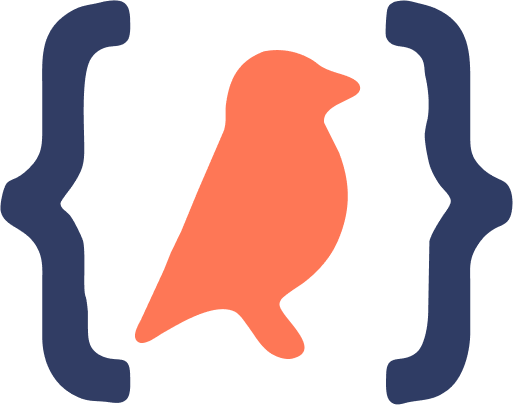
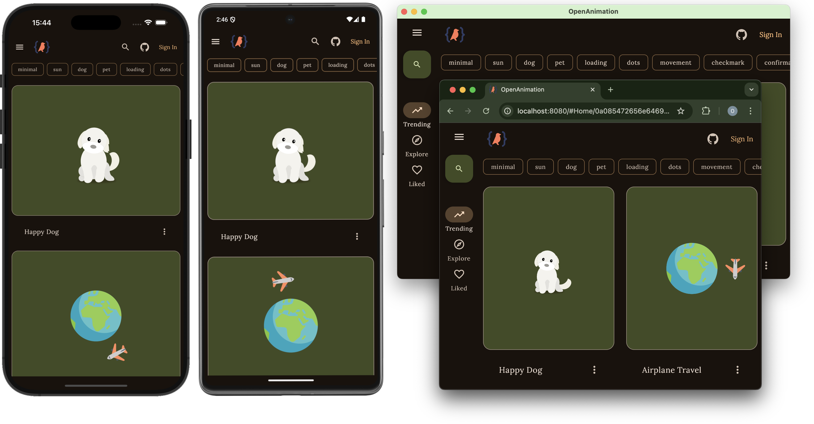

  

   

  <h1>OpenAnimation</h1>

  

    <strong>✨ Check out the live web version: <a href="https://openanimation.web.app">openanimation.web.app</a> ✨</strong>
  

  

    Discover and draw inspiration from a curated collection of beautiful Lottie animations, all powered by Kotlin Multiplatform.
  

  

    

      
      
      
      
    

  

     

   

## 🙏 Libraries Used 
- [Compottie](https://github.com/alexzhirkevich/compottie)
- [Koin](https://github.com/InsertKoinIO/koin)
- [Kotlin Multiplatform](https://kotlinlang.org/docs/multiplatform.html)

## Contributing

Contributions are welcome! Please feel free to submit a Pull Request.

## License

This project is licensed under the MIT License - see the LICENSE file for details.

## TODO

🚧 Color picker 
🚧 Optimizations 
🚧 Community animations 
